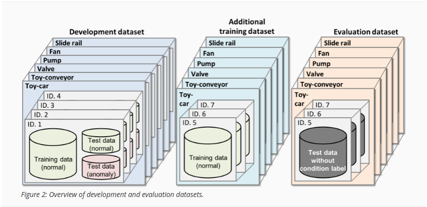

Deadlines 

Timing for the challenge: 

<ul>
    <li>Start date: 02/05/2024</li>
    <li>Due date: 30/05/2024</li>
</ul>

Overview 

In this work, we replicate the DCASE challenge, which is well-known in the signal processing community, as it deals with "Detection and Classification of Acoustic Scenes and Events".

Quoting from the official&nbsp;<a rel="noreferrer nofollow" target="_blank" href="https://dcase.community/challenge2020/task-unsupervised-detection-of-anomalous-sounds">DCASE challenge website</a>&nbsp;(this is the 2020 edition, the 2024 edition is similar)

<blockquote>
    
<strong>Anomalous sound detection (ASD) is the task to identify whether the sound emitted from a target machine is normal or anomalous</strong>. Automatically detecting mechanical failure is an essential technology in the fourth industrial revolution, including artificial intelligence (AI)-based factory automation. Prompt detection of machine anomaly by observing its sounds may be useful for machine condition monitoring.

    
<strong>The main challenge of this task is to detect unknown anomalous sounds under the condition that only normal sound samples have been provided as training data.</strong>&nbsp;In real-world factories, actual anomalous sounds rarely occur and are highly diverse. Therefore, exhaustive patterns of anomalous sounds are impossible to deliberately make and/or collect. This means we have to detect unknown anomalous sounds that were not observed in the given training data. This point is one of the major differences in premise between ASD for industrial equipment and the past supervised DCASE tasks for detecting defined anomalous sounds such as gunshots or a baby crying.

</blockquote>
<h5>Your Objective</h5>

Given normal sound samples of some machine IDs (each sound has information about its machine ID), we want to build a model which can be used to predict whether an unknown sound (this unknown sound belongs to one of the given machine IDs in the training dataset) is normal or anomalous.

Dataset Description

From the official&nbsp;<a rel="noreferrer nofollow" target="_blank" href="https://dcase.community/challenge2020/task-unsupervised-detection-of-anomalous-sounds">DCASE challenge website</a>:

<blockquote>
    
The data used for this task comprises parts of ToyADMOS and the MIMII Dataset consisting of the normal/anomalous operating sounds of six types of toy/real machines. Each recording is a single-channel (approximately) 10-sec length audio that includes both a target machine's operating sound and environmental noise. The following six types of toy/real machines are used in this task:

    <ul>
        <li>Toy-car (ToyADMOS)</li>
        <li>Toy-conveyor (ToyADMOS)</li>
        <li>Valve (MIMII Dataset)</li>
        <li>Pump (MIMII Dataset)</li>
        <li>Fan (MIMII Dataset)</li>
        <li>Slide rail (MIMII Dataset)</li>
    </ul>
</blockquote>

To make this challenge be suitable for the scale of the AML course, we will work on only one machine type (i.e. Slide rail).

<h5>Recording procedure</h5>
<blockquote>
    
The ToyADMOS consists of normal/anomalous operating sounds of miniature machines (toys) collected with four microphones, and the MIMII dataset consists of those of real-machines collected with eight microphones. Anomalous sounds in these datasets were collected by deliberately damaging target machines. For simplifying the task, we used only the first channel of multi-channel recordings; all recordings are regarded as single-channel recordings of a fixed microphone. The sampling rate of all signals has been downsampled to 16 kHz. From ToyADMOS, we used only IND-type data that contain the operating sounds of the entire operation (i.e., from start to stop) in a recording. We mixed a target machine sound with environmental noise, and only noisy recordings are provided as training/test data. The environmental noise samples were recorded in several real factory environments. For the details of the recording procedure, please refer to the papers of&nbsp;<a rel="noreferrer nofollow" target="_blank" href="https://ieeexplore.ieee.org/document/8937164">ToyADMOS</a>&nbsp;and&nbsp;<a rel="noreferrer nofollow" target="_blank" href="https://dcase.community/documents/workshop2019/proceedings/DCASE2019Workshop_Purohit_21.pdf">MIMII Dataset</a>.

</blockquote>
<h5>Development and evaluation datasets</h5>
<blockquote>
    
We first define two important terms in this task: Machine Type and Machine ID. Machine Type means the kind of machine, which in this task can be one of six: toy-car, toy-conveyor, valve, pump, fan, and slide rail. Machine ID is the identifier of each individual of the same type of machine, which in the training dataset can be of three or four.

    
The Figure below shows an overview of our dataset, which consists of a development dataset, an additional training dataset, and an evaluation dataset.

    <ul>
        <li><strong>Development dataset</strong>: Each Machine Type has three or four Machine IDs. Each machine ID's dataset consists of (i) around 1,000 samples of normal sounds for training and (ii) 100-200 samples each of normal and anomalous sounds for the test. The normal and anomalous sound samples in (ii) are only for checking performance therefore the sound samples in (ii) shall not be used for training.</li>
        <li><strong>Evaluation dataset</strong>: This dataset consists of the same Machine Types' test samples as the development dataset. The number of test samples for each Machine ID is around 400, none of which have a condition label (i.e., normal or anomaly). Note that the Machine IDs of the evaluation dataset are different from those of the development dataset.</li>
        <li><strong>Additional training dataset</strong>: This dataset includes around 1,000 normal samples for each Machine Type and Machine ID used in the evaluation dataset. The participants can also use this dataset for training.</li></ul>
</blockquote>

<strong>  Note that</strong>&nbsp;the Machine IDs used in the development dataset are different from those used in the evaluation dataset to avoid leaking label information during the training. The&nbsp;<strong>Development dataset</strong>&nbsp;is used to develop a model and tune hyper-parameters. Then, the model should be re-trained on the&nbsp;<strong>Additional training dataset</strong>&nbsp;before making predictions on the&nbsp;<strong>Evaluation dataset</strong>.

  <strong>Attention</strong>: as for all the AML challenges, we do not want to focus on model performance too much: instead of aiming <strong>only</strong>&nbsp;for being the first in a leaderboard, we want groups to focus on their methodology. This is why we will not use the evaluation dataset, but it is left for you here such that you can invent <strong style="font-size: 0.9375rem;">original approaches.</strong>&nbsp;For example you could try using an existing, pre-trained model (why not an LLM)to "synthetically label" the files in the test directory.  <h5>How to access the data?</h5>
The dataset we use is a selection of the original one used in the official competition. Nevertheless, it is still a rather big chunk of roughly 2GB of audio data. You can download the data (and have a look at it) from my <a href="https://www.kaggle.com/datasets/michiard/dcase-aml" target="_blank">Kaggle dataset page</a>.

Here you have two choices: either you download the data and use it on your laptop or upload it back to for example your Google drive for accessing it using a Google Notebook, or you can use the Kaggle platform. In this last case, you can either clone the dataset, or try to access it directly from my dataset page, through your Kaggle Kernel (called notebook).

Metrics
Participants will calculate anomaly scores for each chosen test sample, instead of a boolean decision result (anomalous, not anomalous).&nbsp;The anomaly score takes a large value when the input signal is detected to be anomalous, and vice versa. Ideally, we strongly suggest to use as a metric for the evaluation of this competition the <a href="https://en.wikipedia.org/wiki/Receiver_operating_characteristic" target="_blank">Area Under Curve (AUC)</a>.   

        <h5>Important note:</h5>
    

Where are my labels? You will notice that the test set (clearly) has no labels! This is used in a "real world" challenge, whereby you are asked to predict labels for unseen data during training. Labels are "kept secret" by the challenge organizers, and the automatic evaluation system uses a submission file to compare to the "secret ground truth".

Since we will not have this step in the AML course, you are tasked with the important goal of splitting your training set, and hold out validation and test data to check the performance of your model.

